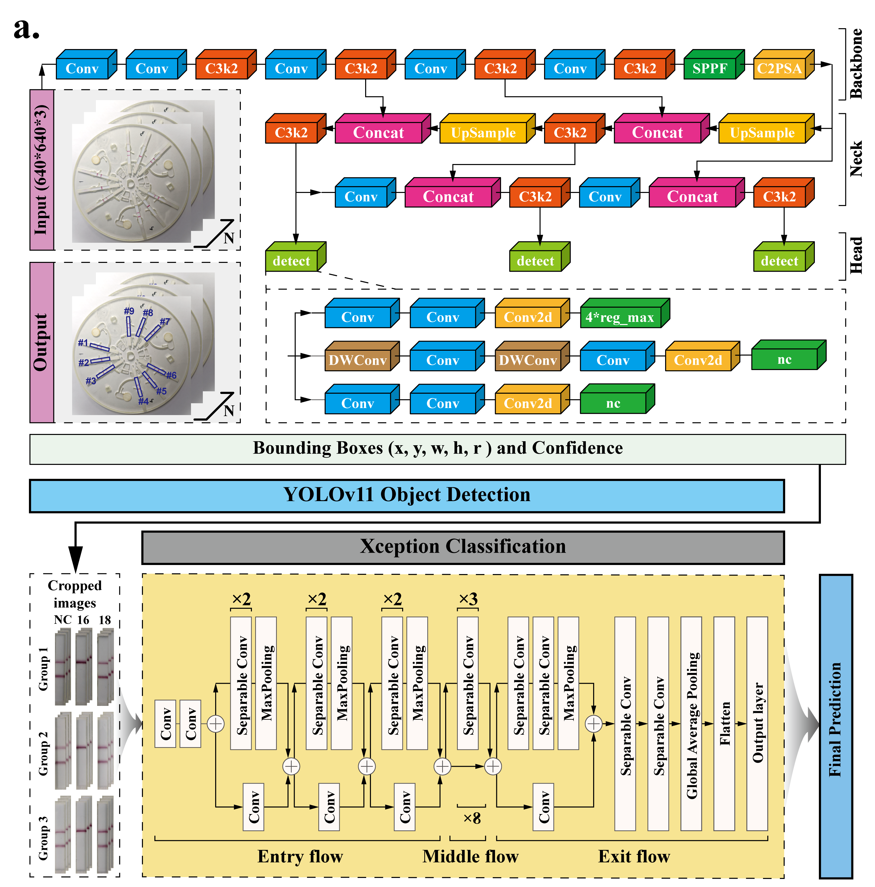

# SID-WAVES: Smartphone-Integrated Diagnostics with Wax-encoded Amplified and Versatile Evaluation System

[](https://opensource.org/licenses/MIT)
[]()
[]()

SID-WAVES is a mobile-based intelligent system designed for the convenient and accurate interpretation of microfluidic chip detection results. By integrating a **YOLOv11-based detection model** and an **Xception-based classification model**, it provides an end-to-end solution from image capture to result output.


---

## 📲 Direct Installation For Quick Testing

For reviewers or users who wish to test the application directly without building from source:
- **Download APK**: Navigate to the [APK/](APK/) folder and download `app-sid-waves.apk`.
- **Installation**: 
   * 1. Transfer the `.apk` file to your Android device.
   * 2. Enable "Install from Unknown Sources" in your device settings.
   * 3. Install and launch **SID-WAVES**.

---

## 📸 System Workflow


*Figure 1: Workflow of the SID-WAVES system.*

---

## 📂 Repository Structure

```text
SID-WAVES/
├── APK/                       # Pre-compiled application package
│   └── app-sid-waves.apk      # Ready-to-install Android APK
├── android_app/               # Android Studio Project (Source Code)
│   ├── build.gradle           # Project-level gradle config
│   ├── app/
│   │   ├── build.gradle       # Module-level gradle config
│   │   ├── src/               # Java Source Code (MainActivity, DetecTool and Box)
│   │   └── assets/            # Compiled TFLite models for mobile deployment
├── inference_scripts/         # Python pipeline for verification/desktop usage
│   ├── main.py                # Main script to run the full pipeline
│   ├── pipeline.py            # Integrated logic for YOLO + CNN
│   ├── detection.py           # YOLO detection wrapper
│   ├── classification.py      # CNN classification wrapper
│   ├── cropping.py            # ROI extraction logic
│   ├── preprocessing.py       # Image enhancement and normalization
│   └── requirements.txt       # Python dependencies
├── weights/                   # Model weights
│   ├── yolo_model.pt          # Original YOLO weights (PyTorch)
│   └── cnn_model.keras        # Original CNN weights (Keras)
├── images/                    
│   ├── demo_image/            # Figures for README (TOC, Workflow, Detection results)
│   └── samples/               # 10 test sample images for microfluidic chips
├── .gitattributes
├── README.md
└── LICENSE
```
---

## 🚀Getting Started

### 1. Android Application
The app is built with **Java** in Android Studio.

  * **Prerequisites**: Android SDK 30 or higher.
  * **Source Code**:
    * `MainActivity.java`: Handles UI, camera, and the main application lifecycle.
    * `DetecTool.java`: Implements the core inference logic by integrating both the detection and classification models to generate the final diagnostic predictions.
    * `Box.java`: Manages post-processing of the detection results, including sorting and grouping the bounding boxes to ensure structured output.
  * Setup:
    * Open the `android_app` folder in Android Studio.
    * Sync Gradle files and build the project.
    * Deploy to an Android device via USB or by generating a new APK.
### 2. Python Inference Pipeline
Verify the dual-model logic on a PC using the provided sample images:
  * Environment: Python 3.8+
  * Installation:
    ```bash
    cd inference_scripts
    pip install -r requirements.txt
    ```
 
### 3. Model Development & Conversion
The system utilizes a dual-model architecture for high-precision interpretation:
  * **Detection Model (YOLOv11)**: Trained to identify the precise coordinates of reaction chambers on the microfluidic chip.
  * **Quantification Model (Xception)**: A classification network designed to analyze the signal intensity within the detected regions.
  * **TFLite Conversion**:
    * The original models (`.pt` for YOLOv11 and `.keras` for Xception) were optimized and converted to `.tflite` format using the TensorFlow Lite Converter and the Ultralytics export tool.
    * These optimized files are located in `android_app/app/src/main/assets/` for mobile deployment.
      
### 4. Testing with Sample Images
We have provided 10 sample images in `images/samples/` for verification.
 1. Ensure you have installed the dependencies in inference_scripts/requirements.txt.
 2. Run the pipeline:
    ```bash
    python main.py --input ../images/samples/ --output path/to/output --yolo ../weights/yolo_model.pt --cls ../weights/cnn_model.keras
    ```
  3. Visualized Rusults
      * Detection Results
        .jpg)
        *Figure 2: Visualization of OBB detection results.Each reaction zone is precisely identified and assigned an index.*
     * Prediction Results
       The output table displays the diagnostic status for different groups:
       
       | Name | Group | NC | HPV16 | HPV18 |
       | :--- | :--- | :--- | :--- | :--- |
       | c (1).jpg | Group1 | 0 | 1 | 0 |
       | c (1).jpg | Group2 | 0 | 1 | 0 |
       | c (1).jpg | Group3 | 0 | 1 | 0 |
     *(Note: The prediction results are generated by the classification model based on the cropped ROIs from the YOLO detection. **0** represents **Negative**, and **1** represents **Positive**.)*  
       
---
## 📜License

This project is licensed under the MIT License - see the [LICENSE](https://github.com/tangxinin/SID-WAVES/LICENSE) file for details. 

---
## 📧Contact
**Tang Xin** - [tangxin0928@foxmail.com]


